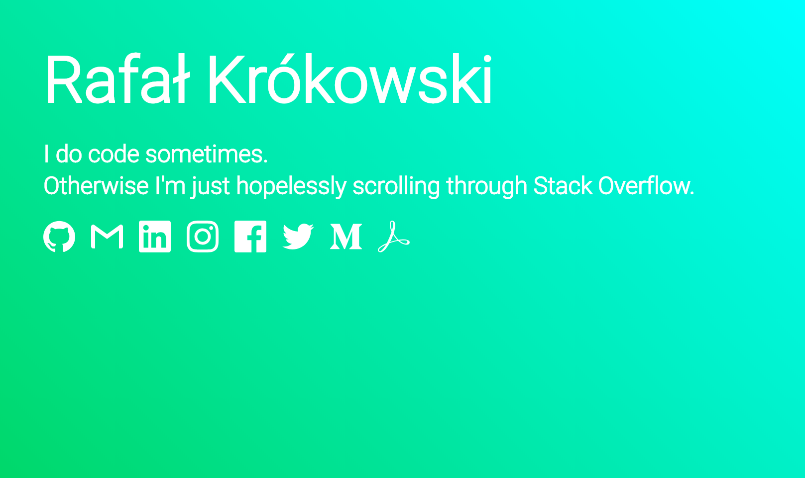

# krokowski0x.com

This repo is meant to become my portfolio, with all my major projects, links and articles listed and presented in minimal, aesthetic fashion. It's also constant work in progress as I'd experiment here with different tools, frameworks and technologies, but I'd try my best to keep it up and running once its major parts will be complete.

## Built with

- [Next.js](https://nextjs.org/) - lightweight framework for static and server‑rendered applications
- [React](https://reactjs.org/) - most natural and intuitive (well, at least for me) JS framework
- [Express](https://expressjs.com/) - Web framework for [Node.js](https://nodejs.org/en/) which needs no introduction
- [Jest](https://jestjs.io/) - delightful JavaScript testing with [Enzyme](https://github.com/airbnb/enzyme) for shallow rendering
